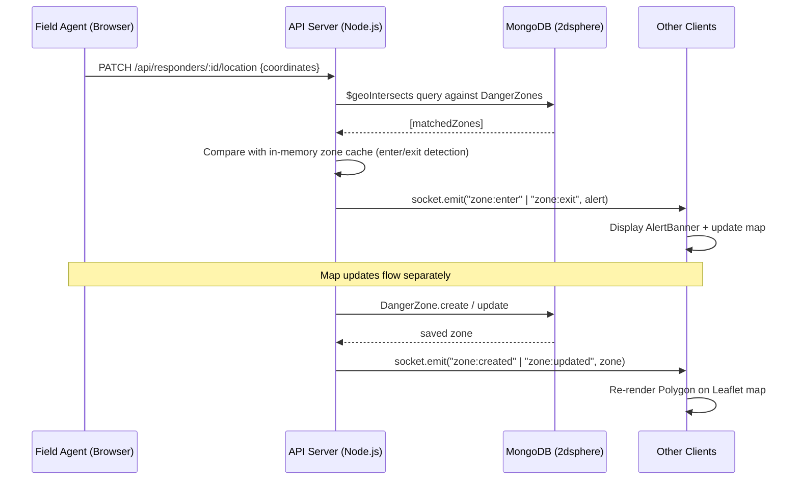
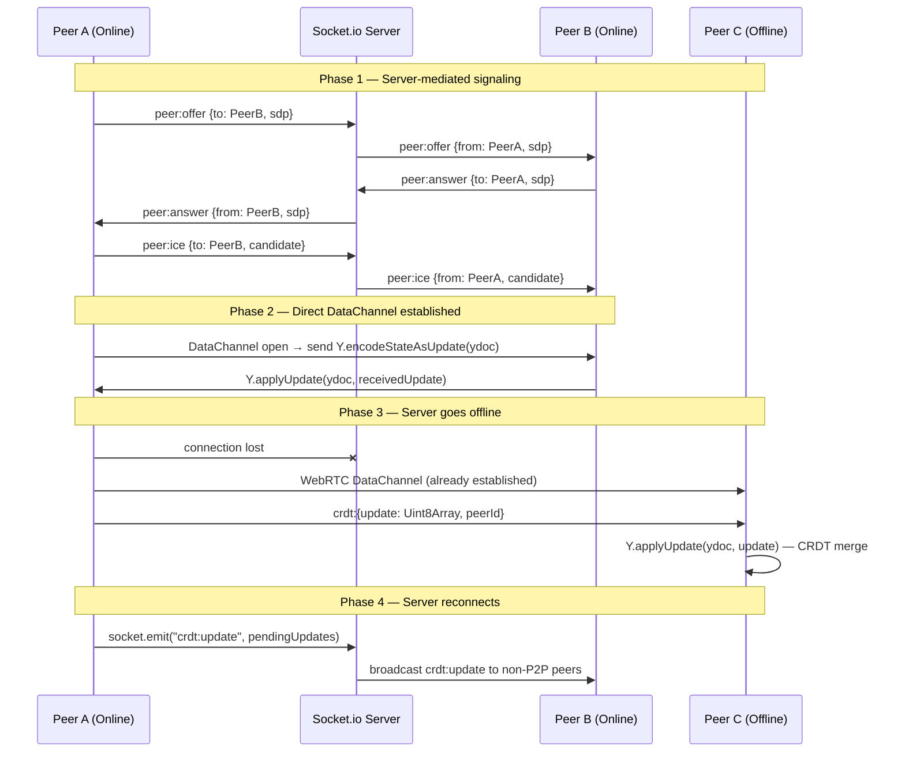
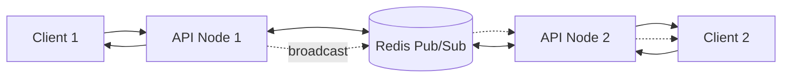

# Project Mirage — System Design

## Architecture Overview

Project Mirage is a Turborepo monorepo with three packages:

```
project-mirage/
├── apps/
│   ├── api/          Node.js 22 + Express + Socket.io
│   └── web/          React 19 + Vite + Leaflet + Yjs
└── packages/
    └── shared/       Types, constants, CRDT helpers
```

The system operates in two modes:
- **Online mode**: clients connect to the API; Socket.io relays real-time events; Redis scales horizontally.
- **Offline/P2P mode**: clients form a WebRTC mesh; Yjs CRDTs sync state without a server.

---

## Geospatial Data Flow



---

## P2P Sync & CRDT Logic



---

## CRDT Conflict Resolution

Yjs uses a **YATA (Yet Another Transformation Approach)** algorithm. Each operation is assigned a globally unique `(clientId, clock)` tuple. Concurrent inserts are resolved deterministically by clientId ordering, guaranteeing:

- **Commutativity**: `merge(A, B) = merge(B, A)`
- **Idempotency**: applying the same update twice has no effect
- **Associativity**: `merge(merge(A, B), C) = merge(A, merge(B, C))`

The shared `ResourceHub` state is stored in a `Y.Map` keyed by hub `_id`. Each resource item is a nested `Y.Map`. Updates to quantity are last-write-wins at the field level.

---

## MongoDB Schema & Indexes

```
DangerZone
  geometry: GeoPolygon  → index: 2dsphere
  severity: enum
  active: boolean

ResourceHub
  location: GeoPoint    → index: 2dsphere
  resources: [ResourceItem]

Responder
  location: GeoPoint    → index: 2dsphere
```

Key queries:
- `$geoIntersects` — point-in-polygon for geofence checks
- `$near` — proximity sort for resource discovery
- `$geoIntersects` with bbox Polygon — viewport-bounded zone fetch

---

## Socket.io + Redis Scaling



The `@socket.io/redis-adapter` ensures events emitted on Node 1 are received by clients connected to Node 2.

---

## Security Model (Node.js 22 Permission Model)

The API is started with:
```
node --experimental-permission \
  --allow-fs-read=./src \
  --allow-net=localhost:27017,localhost:6379 \
  src/index.js
```

This restricts the process to only the declared filesystem paths and network endpoints, limiting blast radius of any supply-chain compromise.
